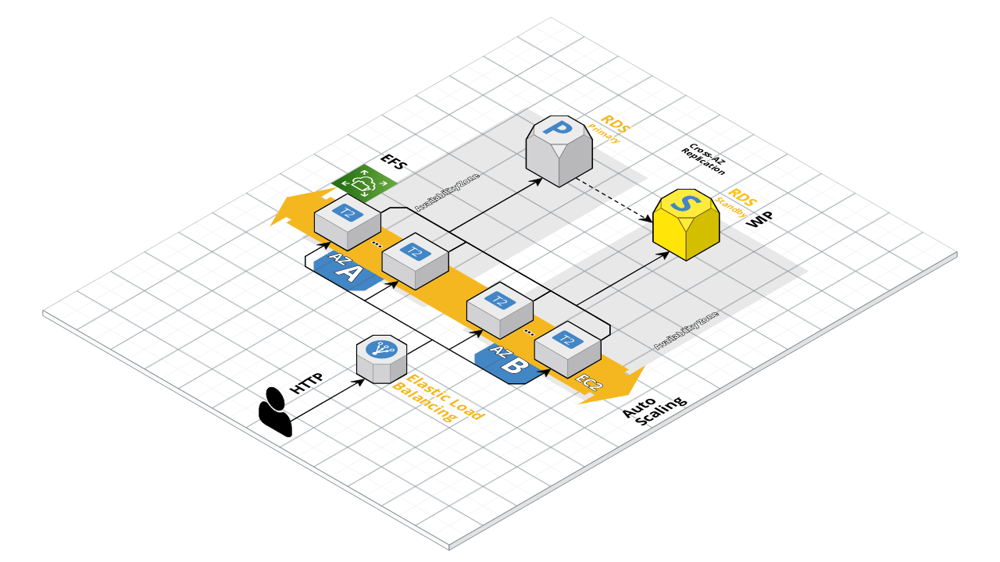

# devops_exercise
_Esempio di esercizio DevOps_

## Disegno architetturale

## Descrizione architettura
le componenti principali sono:  
- Auto_scaling_group
    - EC2 (run docker)
- ELB 
- RDS (non )

### Feature richieste  
- [x] secure*
    - l'accesso alla pagina è garantito da ssh tramite chiavi RSA
    - **HTTPS non è stato implementato** perché non ho accesso a un dominio o alle funzionalità AWS con il mio account.
- [x] fast
    - il sito è fruibile
- [x] fault-tolerant
    - le richieste HTTP sono cordonate da un ELB
    - le macchine EC2 sono lanciate in differenti AZ
    - **RDS none è stato implementato fault-tolerant** per lo stesso motivo di cui sopra "HTTPS"
- [x] adaptive to average load*
    - la policy di ASG è che se il carico "CPU" è alto per ~4m si avviano altre istanze nella region  
- [x] CI/CD pipeline*
    - ho creato una pipeline per **terraform** al push sul master, non avendolo potuto fare per wordpress   

## Terraform  
### Prerequisiti
_Il codice è Free Tier friendly_ 

Accesso ad un **account AWS cloud**, aver **terraform-cli** installato e connesso ad un account **terraform** cone da questo [Link](https://developer.hashicorp.com/terraform/tutorials/automation/github-actions?in=terraform%2Fautomation)  

### Terraform 
Dopo aver inserito una "key_pair" EC2 nella regione dal nome "wordpress".

si possono lanciare i seguiti comandi
`cd es4`
`terraform fmt`
`terraform validate`
`terraform apply`

## Test scalabilità (dentro istanza ec2)

`sudo apt install stress -y`  
`stress -c 90`  
attendere ~4m per attivare la auto-scaling policy per aumentare il numero di istanze.
